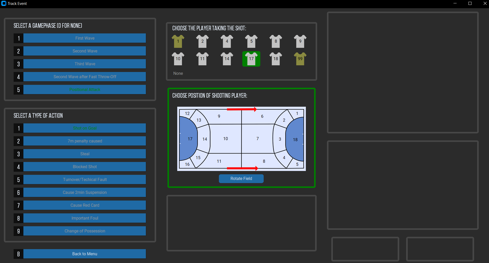
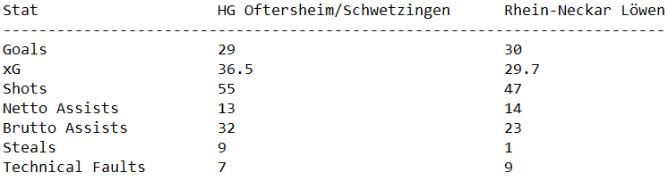
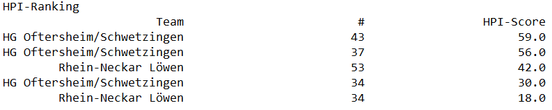
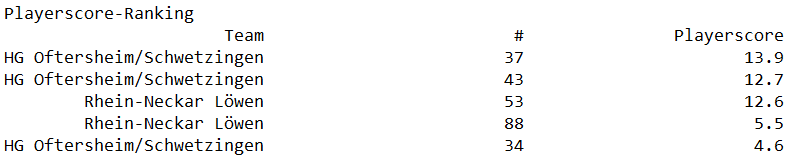

# Motivation
The aim of this project is to introduce data-driven analysis as an additional tool for developing young athletes and to make it accessible to ambitious teams that may not have a professional infrastructure. This initiative is not focused on using statistics to maximize a team’s success in individual games. Instead, it aims to help players and their coaches to evaluate their long-term development independent of match-day results.
While there is a solid scientific foundation for developing attributes like strength, speed, and endurance, there remains, to my knowledge, limited understanding of which measurable data points can reliably predict a young player’s eventual performance level, and which metrics are less relevant. Even when there are clear developmental goals for certain skills, we often lack effective ways to verify them or at least do not know how to verify them. Let me make this clear with the following example.

 <figure>
  
  <figcaption style="text-align: center; font-size: 0.9em; color: #555;">Suggestion of Training by RTK</figcaption>
 </figure>

For instance, in German U15 teams, there is an emphasis on fast-paced play and active defending with guidelines suggesting what proportion of the training time should be used for these areas. For more information take a look at the [RTK](https://www.dhb-trainercenter.de/dhb-rahmentrainingskonzeption/). But how can we verify whether these goals are being met? First, we need to collect all accessible statistics, and then interpret them accurately. Are we successful if we see many  first- or second-wave shots but relatively few goals compared to other teams? What metrics indicate a strong active defence? Typically, in a highly-paced game with active defending on both sides, we observe a higher scoring than in a slow-paced game with two teams parking the bus. Therefore, it's crucial to consider indicators like the number of steals, blocks, and forced errors. Additionally, evaluating where and under what conditions a shot is taken can give valuable insights into both the goalkeeper’s and the shooter’s performance.
It seems clear to me that both extensive data collection and detailed statistical analysis are necessary. In other sports, it is already daily routine to rate players based on to their meta-stats. The days are gone when a football club would make a costly investment in an unknown forward simply because he scored 10 goals last season or because a scout “had a good feeling” about him. Instead, terms like “Expected goals” , “Expected assists” or “players dribbled over per 90 minutes” are frequently used to find the ideal player. Similarly, Germany’s Handball Bundesliga is making an attempt to provide a score based rating system to find out which is the best player. However, these advanced metrics require vast amounts of data, which are typically only available for higher leagues of senior handball. And even if we could access all the necessary data and calculate every imaginable statistic, it would still be challenging to distinguish the essential metrics from the less relevant ones. To address this, we need an insight of how the statistical profile of a today’s first league players looked like when they were 14 years old to identify critical statistics, as well as a large volume of such profiles to conduct a robust analysis. 
In summary, my vision is to provide a set of key statistics that genuinely help to evaluate the development of young handball players. This requires an easily realisable data-tracking routine and a high-quality analysis which itself requires first a good amount of advanced metrics that need to be tested and lot of data to filter out the important ones. As you can see, the path is clear though admittedly long.

# Project Origins
The idea for this project came to me after a trip to France with Handball Baden-Württemberg, where I had the opportunity to participate as an assistant coach being for instance responsible for data collection during games. I've often felt dissatisfied with traditional game statistics, which typically involve counting goals, shots, and mistakes and heavily judging players based on these raw numbers. This motivated me to experiment with a new way of tracking in-game events.

 <figure>
  
  <figcaption style="text-align: center; font-size: 0.9em; color: #555;">Pen and Paper Stat Sheet</figcaption>
 </figure>

In particular, I began challenging myself to record as much information as possible using only pen and paper. The result of this was a densely filled piece of paper focusing on shot locations, the shooter, which part of the goal was targeted, and the outcome of each shot. To be clear, I am sure there many other people out there doing the same or better statistics during a game and I do not want to claim the invention of any of this. However, I was struck by how this helped me to identify solutions during the game that others had not noticed. Back in Germany with those impressions in mind, I came across some interesting blog posts of [handballytics](https://handballytics.de/). He introduced methods to measure game pace and normalized attacking power. Even more interesting was his introduction of expected goals for handball –an idea that resonated with my own focus of shot locations for in-game statistics. I was fully hooked to the topic when I calculated the expected goals for a game where I felt the stronger team had lost, and the expected goals metric supported my impression. This was when I became convinced that advanced statistics like these could provide a more objective measure of performance. 

 <figure>
  
  <figcaption style="text-align: center; font-size: 0.9em; color: #555;">Tracking Menu</figcaption>
 </figure>

However, I quickly realized that manually tracking these stats is challenging to sustain, so in the following weeks, I began designing the structure of a tracking tool that would allow for efficient data collection. This led to the development of the first terminal-based event tracker with basic analysis capabilities. Over the next year and a half, I created two new versions of the terminal-based tracker, a graphical user interface for the new tracker, new statistical analyses, options for long-term statistics, a tool for creating folders containing a possible statistics in a structured way and a complete visualization.

 <figure>
  
  <figcaption style="text-align: center; font-size: 0.9em; color: #555;">Event Menu</figcaption>
 </figure>

 
I successfully tracked an entire season of youth handball and gathered the first results and impressions. The idea had come to life, and the first steps were taken, though there is still a long journey ahead.

# Current Capabilities
The current version of the tool provides five main classes of analysis: stat sheets, pace analysis, conversion rates, absolute stats and performance scores. These categories can sometimes overlap, and a few of the names may seem misleading, so I’ll briefly clarify each. The stat sheets are a reminiscent to the project’s origin. They are basically a straightforward record of the game, similar to what I would capture using pen and paper. There is no deeper analysis done and a lot of information is dropped. However, it is clearly organised and in a single view. In the pace analysis the game’s tempo by tracking the number of attacks and the number of goals scored per 50 attacks. The conversion rates consist of stats such as shots taken, goals scored and conceded, the shot-to-goal ratio, expected goals (xG), the difference of expected and actual goals and the expected goals per shot. Those numbers are broken down to nearly every possible combination of shot scenarios including position, distance, game phase, and shot type. Absolute stats cover all other raw numbers collected during the game, such as assists, steals, blocks and technical faults. Finally, the performance scores offer two different approaches: Handball-Performance-Index (HPI) and Playerscore. The first one works similarly to the idea of expected goals but extends to all type of actions. Here, each action type has a specific weight, which is summed up for each player which then leads to a score. Playerscore, on the other hand, scores every action equally but adjusts weights based on game time and score context. For instance, a goal scored in a tight, late-phase game has a higher value than one scored early on or in a game with a decisive lead. In essence, HPI emphasizes the type of action, while Playerscore considers the game situation in which the action occurs.
# A Practical Example
The following example demonstrates a possible idea to work with the statistics gathered. For this, I will use a match between HG Oftersheim/Schwetzingen and Rhein-Neckar Löwen in the U15-Oberliga Baden. These teams are among the strongest in their region, making this matchup a highlight each season. However, being the youth team of a Bundesliga club, the Rhein-Neckar Löwen usually bring in the individually more skilled players and is often seen as the favourite for the win.

 <figure>
  
  <figcaption style="text-align: center; font-size: 0.9em; color: #555;">Game Statistics</figcaption>
 </figure>

 
Although the game ended with a close win for Rhein-Neckar Löwen (30:29), the raw statistics suggest that the teams were not as evenly matched as the score implies. While the “Netto Assists”, i.e. those resulting in goals, are on equal level, the “Brutto Assists” differed by nine in favour of HG Oftersheim/Schwetzingen. Additionally, the expected goals (xG) leaned significantly toward HG Oftersheim/Schwetzingen, hinting that they may have outperformed their opponent in gameplay quality. If these numbers are reliable, we might view the game as a success in terms of long-term development, as the opponent was at least surpassed in terms of playing capability. A deeper analysis allows us now to find out which type of shots, e.g. wing shots, mid-range shots, breakthroughs, showed the largest gap between expected goals and actual goals. Repeated analysis across games can if this gap is a consistent issue, signalling a need for skill improvement in a particular type of shot, or if it is a one-off occurrence. By analyzing this data for individual players, coaches can determine whether the issue is widespread across the team or specific to certain players. This type of analysis allows coaches to target areas for improvement in tactics, skills, or both, and identify whether these issues are team-wide or individualized. Another insightful picture is the pie chart showing the distribution of goals conceded in different game phases. 

 <figure>
  
  <figcaption style="text-align: center; font-size: 0.9em; color: #555;">Distribution of conceded goals</figcaption>
 </figure>

 
At this level of U15 handball, game tempo is generally intense. In this match, each team executed 63 attacks in 50 minutes, meaning ball possession changed in average every 24 seconds.  So there is still a lot of untapped potential in tempo defence. One approach is to sustaining pressure on the attacking team during third-wave phases. With this counter-pressing tactic, you either try to make your opponent lose the ball or get them into the positional attack. The low number of third-wave goals conceded, combined with the overweight in steals, at least indicates a successful tempo defence. Here a more detailed analysis could examine the type of steals and technical faults occurring during third-wave attacks, and shot types created by the attacking team. Lastly, for an individual performance evaluation both scores- the HPI and Playerscore- are helpful. Here, both scores yield similar results, but clearly indicating the key players in this game. Comparing with the eye-test there are at least some surprises in these TOP5-lists. When comparing HPI and Playerscore, the switch in rankings for certain players could indicate their greater ability to make smart plays under pressure. However, to make such conclusions, we would need data from multiple games.
<figure>
  
  
  <figcaption style="text-align: center; font-size: 0.9em; color: #555;">TOP5 of HPI and Playerscore</figcaption>
 </figure> 
Let us stop this analysis here for now. I hope to show the depth of insight that can be gained from a single game in this example. While not every insight requires detailed statistics, and some may be less relevant, deeper analysis almost always uncovers valuable findings that might otherwise be missed.
For an example of a full-season analysis, take a look at the article I wrote for [hghandball.de](https://www.hghandball.de/saisonbericht-mal-anders/).

# Future Directions
With the new GUI Tracking Tool in place, the next focus will be expanding the range of calculated statistics. Currently, I am thinking of bringing the distance of a pass into account, collecting expected assists, and working out new type of performance scores. Improved graphical presentation is also needed, allowing the data to be accessible not only for coaches but also for young players. For that I aim to create an interactive tool for data visualization to make insights more intuitive and engaging. Lastly, increasing the volume of collected data is another priority. The user-friendly GUI Tracking Tool enables colleagues to gather data for their own teams, ultimately enhancing both their coaching insights and the overall dataset. One promising development for this expansion could be applying computer vision, which could either automate data collection or enrich the quality and quantity of collected data.

If you are interested in the topic or have any suggestions for improvement, feel free to contact me.